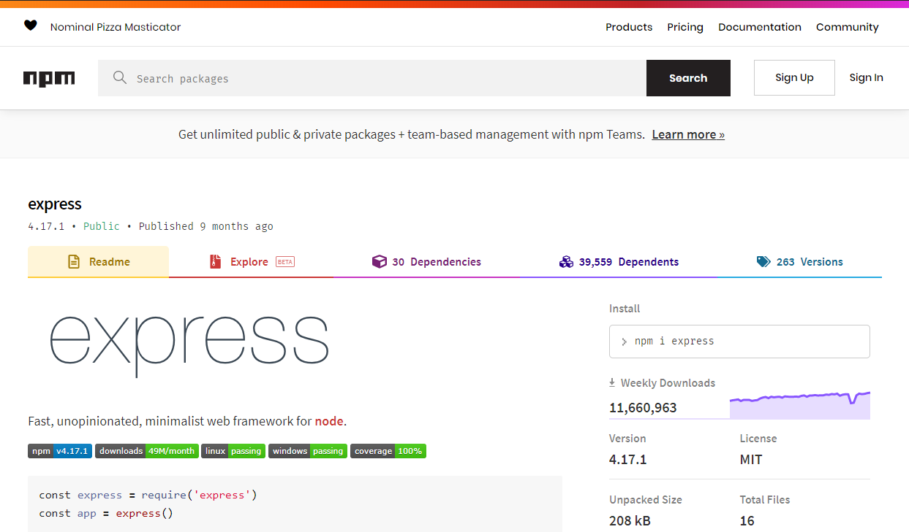

# Express



---

## One of the most important node modules

It removes _a lot_ of the complexity around creating and maintaining a server.

---

### Example

This will give us a barebones server that we can _GET_ content.

```js
const express = require("express");

const app = express();

app.get("/", (req, res) => {
  res.send("hello");
});

app.listen(4000);
```

---

When you type a url in the browser, or click a link on a webpage, you are making...

**...a GET request to a server somewhere. You are _requesting_ content.**
