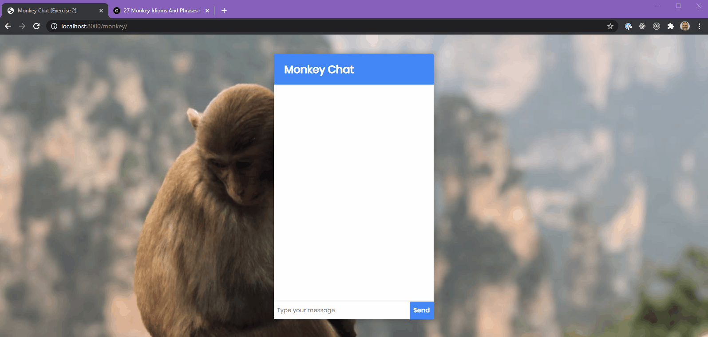

# Exercise 2 - Monkey Chat



For this exercise, the frontend code is complete. We're using code similar to what you built in exercise 1. All code is to be written in the `server.js` file.

So. Our monkey is more responsive than the cat, but not by much. When the user messages the monkey, it will respond a random message.

Write a new endpoint that is similar to the `/cat-message` endpoint. It should have the following characteristics:

- Uses the `.get()` method
- the endpoint is `/monkey-message`
- the method should respond with a random message from an array of messages.
- feel free to keep the `setTimeout` as it adds a little realism to the interaction. :)

Here is a sample array of random messages.

```js
const messages = [
  "Don’t monkey around with me.",
  "If you pay peanuts, you get monkeys.",
  "I fling 💩 at you!",
  "🙊",
  "🙈",
  "🙉",
];
```
