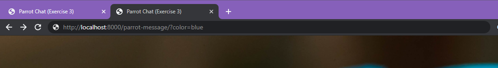
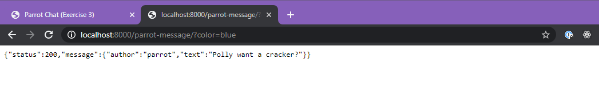
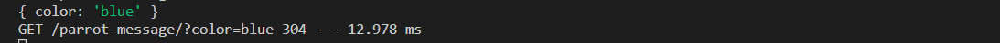

# Exercise 3 - Parrot Chat


As we move through the animal kingdom, it is now time to speak with a parrot. As you might guess, the parrot will just reply with the exact message that the user sent. This starts to make things more complicated for us.

Up to now, the chat app has been querying the server and just getting a message without sending any data to the server. Now we need the chat app to send the user message to the server.

1. Let's start by creating our method and endpoint:

- Uses the `.get()` method
- the endpoint is `/parrot-message`
- the method should respond with a generic message for now. `Polly want a cracker?`
- feel free to keep the `setTimeout` as it adds a little realism to the interaction. :)

2. Sample query parameter

We are going to send the user message to the server with a `query` parameter. It is possible to attach a data to the url that the server can read.

For example, this url contains a additional data in the form of a `query` parameter:

```
http://concordiabootcamps.ca?favoriteFood=avocados&name=Morty
```

- The question mark in a url, indicates the beginning of a `query`.
- Queries are written as key/value pairs (no spaces and separated by an equal sign `=`).
- Key/value pairs are separated by an `&` symbol.

Let's hardcode a query parameter in the url like so:



Notice that we are not loading the frontend page here but the server endpoint. `/parrot-message/?color=blue`.
The server will respond with its `json` object.



This is expected, but not the most interesting...

In the `.get` method, add a `console.log(req.query)` and reload the web page. You should see this in the `node` console (_in VS code_).



🤯 The request from the site contains an object that breaks down the query parameters into key/value pairs.

Use this super-power to pass the user message from the frontend to the backend.

- You will need to modify the url `fetch` call in `parrot/scripts.js` to be _dynamic_. Meaning that you will need to pass the user's message to the server via the query parameter.
- You will need to receive the message in the server endpoint and send it back as the parrot's message.
