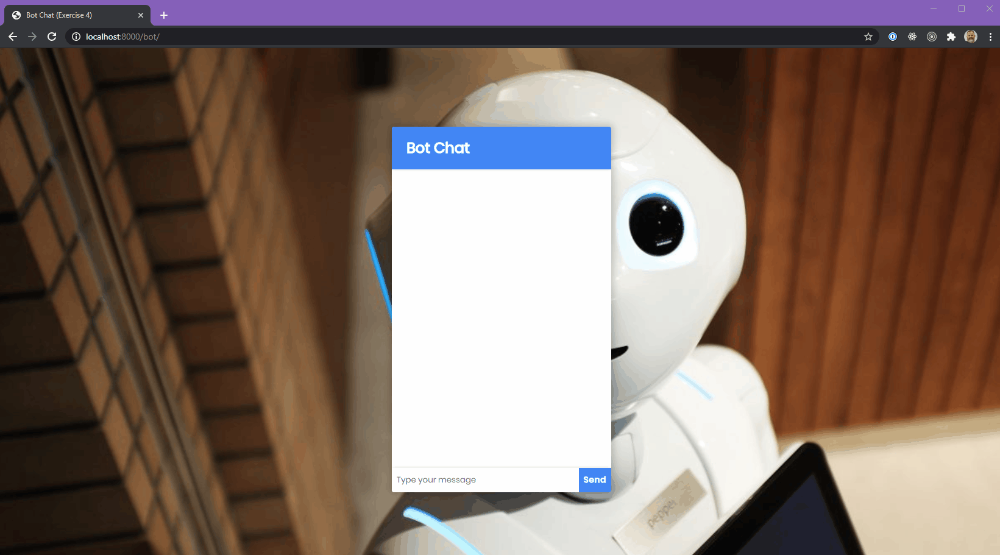
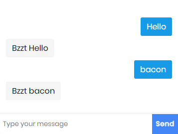
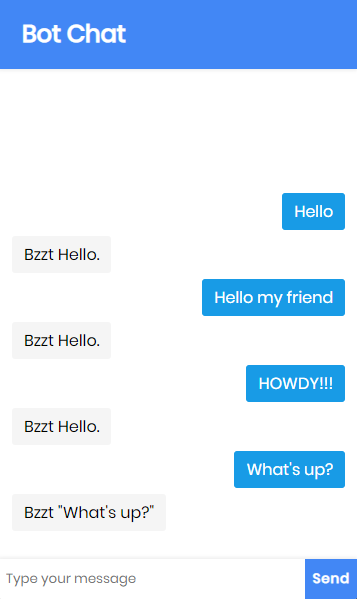

# Exercise 4 - Bot chat



Time to kick things up a notch. Since we can't build something that will connect the user to a human, let's do the next best thing: a bot! 🤖.

Let's create a bot that that will _read_ the user message and respond appropriately. This can be a HUGE rabbit hole. So we won't even pretend to make the bot smart, but it should be smarter than our cat, monkey and parrot.

1. Let's start by creating our method and endpoint:

- Uses the `.get()` method
- the endpoint is `/bot-message`
- the method should respond with the user's message plus a `Bzzt` at the beginning. _look at the parrot example if you're stuck._
- feel free to keep the `setTimeout` as it adds a little realism to the interaction. :)

You should end up with something like this.



2. A proper greeting

The bot should respond to any greeting with a greeting of its own.

If a user message `includes` any common greeting word, like

```js
const commonGreetings = ["hi", "hello", "howdy"];
```

One way to do this would be to check if the user's message is in the array.

```js
const getBotMessage = (text) => {
  const commonGreetings = ["hi", "hello", "howdy"];
  let botMsg = "";
  if (commonGreetings.includes(text.toLowerCase())) {
    botMsg = "Hello!";
  }
  return botMsg;
};
```

But this is not ideal. If the user types "Hi", the bot would understand, but if the user types "Hi!!" the bot doesn't get it because the strings don't match.

Rewrite the function above to loop through the `commonGreetings` and check if any of the items exist in the user's text.

- If it does, make the bot say "Hello."
- If it doesn't have the bot repeat what the user said. (with an added 'Bzzt').



3. A fine goodbye.

Repeat what you did for #2 and implement a proper robot goodbye, if the user's text includes a "goodbye" word. Declare an array `commonGoodbyes` and have a few possibilities that the bot would understand.
